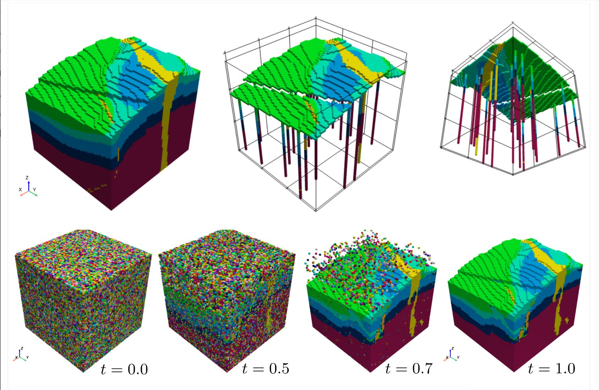

::: {.page-header}

# AIEPS Seminars

[Online talks on AI in Earth & Planetary Sciences]{.tagline}

::: {.meta}
[📅 As announced]{} [📍 Online]{} [🔗 Microsoft Teams / Zoom]{}
:::
:::

::: {.content-body}

::: {.seminar-spotlight}
[Next Talk]{.spotlight-badge}

::: {.past-talks}
::: {.talk-item}

<h4>#2 Synthetic Geology: Encoding Geological Knowledge into Generative AI Models for Probabilistic 3D Reconstruction.</h4>

🎤 <a href="https://www.linkedin.com/in/simonghyselincks/">Simon Ghyselincks</a>, 🏛️ University of British Columbia (UBC), Canada.<a href="https://events.teams.microsoft.com/event/d89586ec-cddb-42fd-933c-269262967b8e@060cdb85-43cf-4df1-b998-18fe372e407a"> 🔗 Register via Microsoft Teams</a>

Reconstructing 3D structural geology from sparse surface and borehole observations is a longstanding challenge with critical applications in mineral exploration, geohazard assessment, and geotechnical engineering. This inherently ill-posed problem is often addressed by classical geophysical inversion methods, which typically yield a single maximum-likelihood model that fails to capture the full range of plausible geology. In this talk, I present StructuralGeo, a rapid simulation engine that generates synthetic lithological models encoding geological knowledge such as the tectonic, magmatic, and sedimentary processes found in textbooks. Using this engine as a synthetic dataset, we train both unconditional and conditional generative AI models that can reconstruct multiple plausible 3D scenarios from surface topography and sparse borehole data, depicting structures such as layers, faults, folds, and dikes. By sampling many reconstructions from the same observations, we gain insight into not only the most likely reconstruction, but also from the full range of plausible reconstructions that fit the data. While the realism of the output is bounded by the fidelity of the simulation engine, this approach offers a method for probabilistic modeling, regional fine-tuning, and use as an AI-based regularizer.

  

:::
:::
:::

::: {.panel-tabset}

### Future Talks

::: {.past-talks}
::: {.talk-item}
<button class="talk-header" data-collapsible="true" aria-expanded="false" tabindex="0">

<h4> #3 Uncertainty quantification using Hamiltonian Monte Carlo for structural geological modelling with implicit neural representations</h4>

🎤 <a href="2026.html">Kaifeng Gao</a>, RWTH Aachen University, Germany · 🗓️ 11 May 2026 

▼
</button>

Three-dimensional geological modelling is an essential tool for understanding subsurface features, supporting advanced exploration of natural resources, their sustainable development, and the identification of optimal locations for carbon storage. Recently, efficient neural network approaches have been developed to handle large datasets and to integrate diverse observations and prior knowledge into geological models. Previous work has demonstrated that neural networks are powerful tools for geological modelling, but quantifying uncertainty in their predictions remains an open issue. In this work, we address the uncertainty arising from both network parameters and observational data. We explore the full space of possible geological model realizations using a Hamiltonian Monte Carlo sampler, and quantify the uncertainty of predicted geological interfaces within a Bayesian neural network framework. Our experimental results demonstrate that the Hamiltonian Monte Carlo sampler effectively explores the posterior distribution in function space and quantifies the uncertainty of predicted geological interfaces for both a noise-free borehole dataset from the North Sea and a noisy dataset interpreted from geophysical well logs in Saskatchewan, Canada. We also apply the method to a simple faulting scenario involving a normal fault in flat stratigraphy. Furthermore, in comparison with the commonly used Monte Carlo dropout approach, the Hamiltonian Monte Carlo sampler exhibits superior accuracy in assessing epistemic uncertainty in a noise-free dataset. However, computational efficiency remains a potential challenge in large dataset and network.

:::
:::

### Previous Talks

::: {.past-talks}
::: {.talk-item}
<button class="talk-header" data-collapsible="true" aria-expanded="false" tabindex="0">

<h4> #1 Neural Earthquake Forecasting with Minimal Information: Limits, Interpretability, and the Role of Markov Structure</h4>

🎤 <a href="https://www.linkedin.com/in/jonas-k%C3%B6hler-5664693a6/">Jonas Köhler</a>, Frankfurt Institute for Advanced Studies · 🗓️ 19 Feb 2026

▼
</button>

Forecasting earthquake sequences remains a central challenge in seismology, particularly under non-stationary conditions. While deep learning models have shown promise, their ability to generalize across time remains poorly understood. We evaluate neural and hybrid (NN + Markov) models for short-term earthquake forecasting on a regional catalog using temporally stratified cross-validation. Models are trained on earlier portions of the catalog and evaluated on future unseen events, enabling realistic assessment of temporal generalization. We find that while these models outperform a purely Markovian model on validation data, their test performance degrades substantially in the most recent quintile. A detailed attribution analysis reveals a shift in feature relevance over time, with later data exhibiting simpler, more Markov-consistent behavior. To support interpretability, we apply Integrated Gradients to analyze how models rely on different input features. These results highlight the risks of overfitting to early patterns in seismicity and underscore the importance of temporally realistic benchmarks.

:::
:::

:::

:::

  <a href="2025.html" class="btn-act" style="font-size:1.1rem; padding:0.6em 1.5em; border-radius:5px; background:#f5f5f3; color:#020133; border:1px solid #e0e0e0; text-decoration:none; font-weight:600; transition:background 0.2s;">⬅️ More talks from previous years</a>

---
